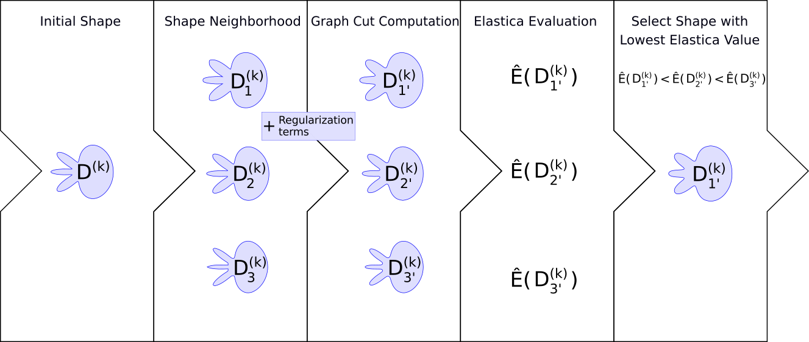

# Abstract

We propose a graph cut model to optimize bidimensional shapes with respect to
the elastica energy. At each iteration our model selects the shape of minimum
elastica value among a set of candidates generated by a discrete process that we
call the balance coefficient flow. In this work we show how the balance
coefficient flow is related to the curve-shortening flow and how our model can
be used to execute the task of image segmentation. Finally, we compare our
segmentation model with the classical graph cut algorithm. 

Authors: Daniel Martins Antunes, Jacques-Olivier Lachaud and Hugues Talbot.

# GitHub Project

The [gf-flow project](https://github.com/danoan/graph-flow) implements the 
graph-flow algorithm and provides a console and GUI interface to interact with. 
The code is written in C++ and it is easily setup via a docker container.

# Coco-Dataset Experiment Report

The graph-flow segmentation model is compared against the grabcut algorithm in a
subset of the [coco-dataset](https://cocodataset.org). The results for all the
images in the experiment are available in this [report](/content/papers/graph-flow/reports/coco-experiment/). 

# Paper Figures

All the figures in the paper can be regenerated via scripts contained in the
[gf-paper-figures project](https://github.com/danoan/gf-paper-figures/)
