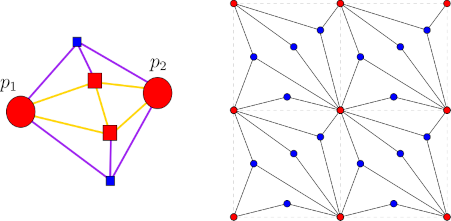

# Abstract

Local search for combinatorial optimization problems is becoming a dominant
algorithmic paradigm, with several papers using it to resolve long-standing
open problems. In this paper, we prove the following '4-local' version of
Hall's theorem for planar graphs: given a bipartite planar graph G = (B, R, E)
such that |N (B)| ≥ |B | for all |B | ≤ 4, there exists a matching of size at
least |B| 4 in G; furthermore this bound is tight. Besides immediately implying
improved bounds for several problems studied in previous papers, we find this
variant of Hall's theorem to be of independent interest in graph theory.

Authors: Daniel Martins Antunes, Claire Mathieu, Nabil Mustafa 

